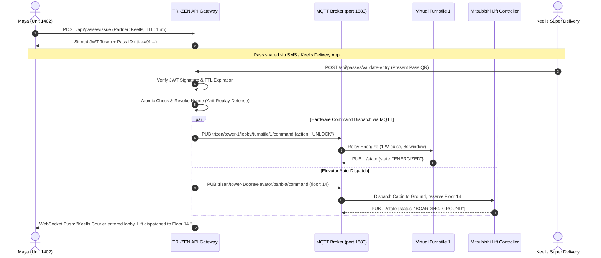

# Deliverable 5: System Architecture Sketch
## TRI-ZEN OS: Enterprise Architecture & Security Blueprint

**Product:** TRI-ZEN OS  
**Client:** John Keells Properties (JKH)  
**Security Standard:** Zero-Trust Cryptographic RBAC & Hardware Abstraction

---

### 1. High-Level Enterprise Architecture Blueprint

```
[ CLIENT LAYER ]
┌─────────────────────────────────────────────────────────────────────────────┐
│  📱 Resident Mobile App (Figma / iOS)  │  🏢 JKH Facilities Operator Console│
│  🎟️ Courier Webview (PickMe / Keells) │  🔑 Cinnamon Guest Portal (Airbnb) │
└──────────────────────────────────────┬──────────────────────────────────────┘
                                       │ HTTPS / WSS (TLS 1.3)
                                       ▼
[ API GATEWAY & ZERO-TRUST SECURITY PERIMETER ]
┌─────────────────────────────────────────────────────────────────────────────┐
│                     TRI-ZEN Edge API Gateway (Node.js)                      │
│  • Asymmetric JWT Verification & Role Claim Scopes                          │
│  • Atomic JTI Nonce Invalidation Cache (Replay Attack Defense)              │
│  • Pass Lifecycle Controller (15-min TTL Expiration Engine)                 │
│  • Natural Language Intent Parser & Assistant Endpoint                      │
└──────────────────────┬───────────────────────────────┬──────────────────────┘
                       │                               │
                       ▼                               ▼
[ PLATFORM MICROSERVICES ]                    [ TIME-SERIES & STATE STORES ]
┌──────────────────────────────────────┐     ┌────────────────────────────────┐
│ • Access & Pass Management Service   │     │ • Redis / Nonce Revocation DB  │
│ • Unit Automation & Scene Engine     │     │ • InfluxDB Telemetry Store     │
│ • JKH Conglomerate Integration Bus   │     │ • PostgreSQL Tenancy & Leases  │
│   (Keells Super, Cinnamon, FriMi)    │     └────────────────────────────────┘
└──────────────────────┬───────────────┘
                       │
                       ▼ (Internal gRPC / TCP)
[ HARDWARE ABSTRACTION LAYER (HAL) & MESSAGE BROKER ]
┌─────────────────────────────────────────────────────────────────────────────┐
│                  Enterprise MQTT Message Broker (Aedes)                     │
│  Topic Isolation: trizen/{tower}/{zone}/{subsystem}/{id}/{command|state}    │
└──────────────────────┬───────────────────────────────┬──────────────────────┘
                       │                               │
                       ▼                               ▼
[ PHYSICAL / SIMULATED EDGE LAYER ]           [ AI PREDICTIVE HEALTH ENGINE ]
┌──────────────────────────────────────┐     ┌────────────────────────────────┐
│ • Lobby Turnstile Relays (12V Pulse) │     │ • Rolling Z-Score Anomaly Core │
│ • Mitsubishi Electric Lift Controller│     │ • Actuation Voltage Decay Rate │
│ • Yale In-Unit Smart Deadbolts       │     │ • JKH Facilities Auto-Triage   │
│ • Daikin/Legrand VRV AC & Curtains   │     │ • 1-Tap Override Guardrail     │
└──────────────────────────────────────┘     └────────────────────────────────┘
```

---

### 2. Role-Based Access Control (RBAC) Enforcement Matrix

Access rights are strictly enforced at the **API Gateway perimeter**, not merely by hiding buttons in the UI.

| Role | Cryptographic Token Type | Turnstile Access | Lift Floor Dispatch | In-Unit Controls (AC, Lights) | Lock Pairing & Factory Reset | Lease Transfer & Sublease | Work-Order Triage |
| :--- | :--- | :--- | :--- | :--- | :--- | :--- | :--- |
| **DEVELOPER_ADMIN** (John Keells Properties) | Permanent RS256 Enterprise JWT | Full Multi-Tower | All 53 Floors | Multi-Unit Audit | Full Administrative Rights | Full Rights | Full Fleet Access |
| **PROPERTY_MGR** (Facilities Team) | Enterprise Operator Token | Service Gates | Service & Resident | Maintenance Mode Only | Restricted | None | Full Work-Order Triage & Override |
| **OWNER** (Unit Landlord) | Long-lived Asymmetric JWT | Tower 1 Lobby | Unit 1402 Floor | Full Unit Control | Authorized | Full Lease Management | View In-Unit Device Health |
| **LONG_TERM_TENANT** (Occupier Maya) | Lease-bounded JWT | Tower 1 Lobby | Unit 1402 Floor | Full Unit Comfort & Scenes | **DENIED (No Reset)** | **DENIED (No Lease Control)** | View In-Unit Device Health |
| **SHORT_TERM_GUEST** (Cinnamon / Airbnb) | Check-in / Check-out Bounded Token | Tower 1 Lobby | Unit 1402 Floor | Comfort Presets Only | **DENIED** | **DENIED** | **DENIED** |
| **COURIER_PASS** (Keells / PickMe) | 15-Minute Single-Use Token | Turnstile 1 Only | Floor 14 Auto-Dispatched | **DENIED** | **DENIED** | **DENIED** | **DENIED** |

---

### 3. Frictionless Delivery Handshake Sequence Diagram



---

### 4. Hardware Abstraction Layer (HAL) Decoupling

A critical architectural achievement for John Keells Properties is that **the business logic never speaks proprietary protocols to physical hardware.**
* If Tower 1 uses Yale smart locks, Tower 2 uses Salto locks, and Tower 3 uses Dormakaba, the backend API Gateway remains completely identical.
* The hardware vendor's edge gateway translates local proprietary Zigbee, Z-Wave, or BACnet signals into our standard MQTT topic taxonomy:
  - `trizen/{tower}/{zone}/{subsystem}/{id}/command`
  - `trizen/{tower}/{zone}/{subsystem}/{id}/state`
  - `trizen/{tower}/{zone}/{subsystem}/{id}/telemetry`
